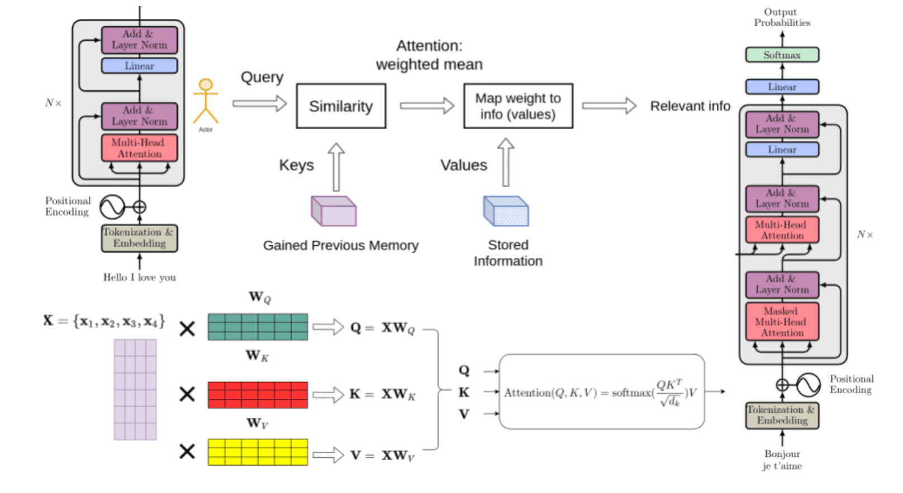
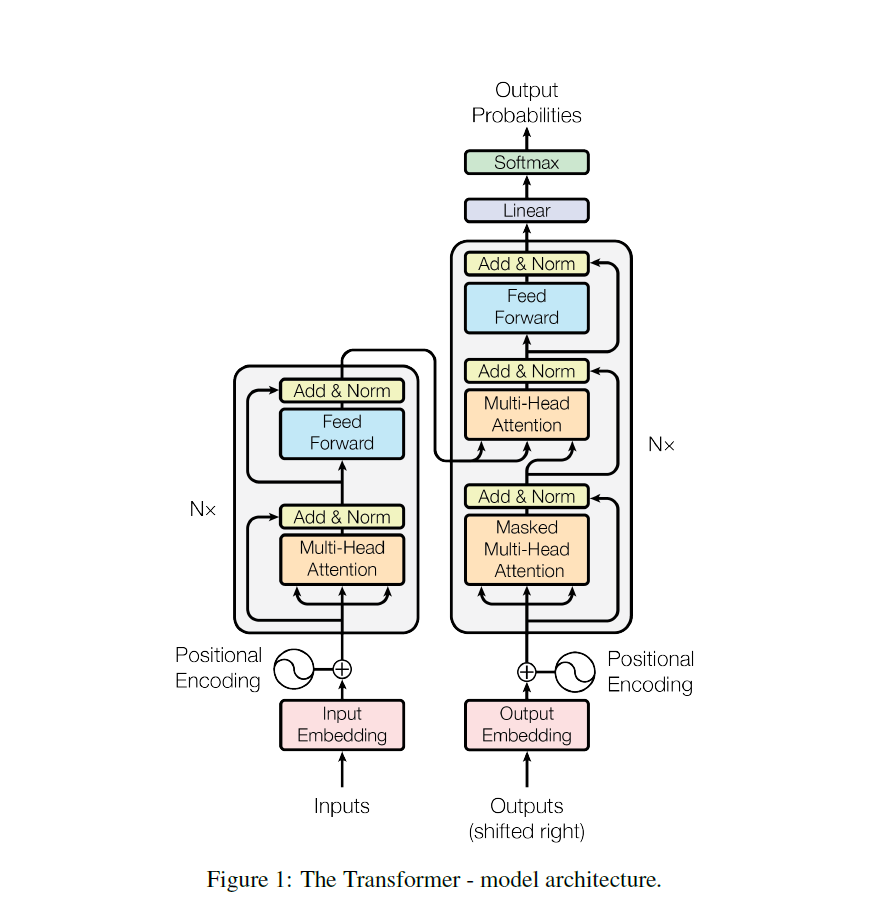
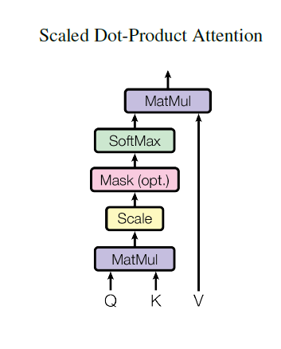
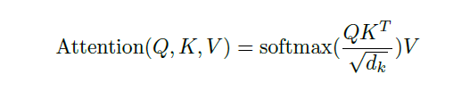
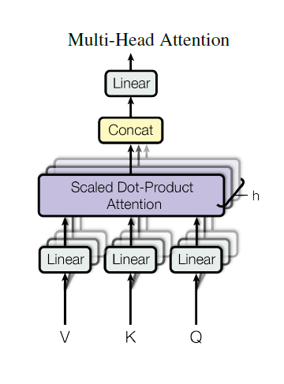
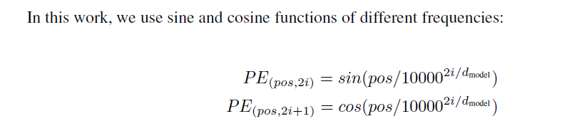

# English → French Transformer Translator

A from-scratch PyTorch implementation of the original Transformer (Vaswani et al., "Attention Is All You Need") architecture, trained for English → French machine translation, served via a FastAPI backend and a Streamlit web UI.

---

## Transformer Architecture Overview

The following figure provides a high-level overview of the complete Transformer architecture proposed in the **Attention Is All You Need** paper. It illustrates how the encoder and decoder interact through the attention mechanism while also showing how Query (Q), Key (K), and Value (V) vectors are generated to compute attention scores.

<p align="center">
  
</p>

### What this figure illustrates

- **Encoder** (left): Converts the input English sentence into contextual representations using Multi-Head Self-Attention and Feed Forward Networks.
- **Decoder** (right): Generates the translated sentence one token at a time using Masked Multi-Head Attention, Encoder-Decoder Attention, and Feed Forward Networks.
- **Query (Q), Key (K), and Value (V)**: These vectors are produced by multiplying the input embeddings with learnable weight matrices (**WQ**, **WK**, and **WV**). They are the foundation of the attention mechanism.
- **Scaled Dot-Product Attention**: Computes similarity between Queries and Keys, applies a Softmax function to obtain attention weights, and combines the Values to produce context-aware representations.
- **Positional Encoding**: Injects positional information into token embeddings, allowing the Transformer to understand word order despite having no recurrence.
- **Multi-Head Attention**: Multiple attention heads learn different semantic and syntactic relationships simultaneously, enabling the model to capture richer contextual information.

This diagram summarizes the complete workflow of the Transformer model, from token embeddings to the final output probabilities used for sequence generation.

---

## Features

- **Custom Transformer** — encoder/decoder, multi-head attention, sinusoidal positional embeddings, causal + padding masks, all built from scratch in `model.py` (no `nn.Transformer`).
- **Memory-efficient data pipeline** — trains BPE tokenizers and pre-tokenizes an arbitrarily large CSV (e.g. an 8 GB corpus) by streaming in chunks and writing to disk-backed `.npy` memmaps, so RAM usage stays flat regardless of dataset size.
- **Mixed-precision training** with gradient accumulation, gradient clipping, cosine LR scheduling, and checkpoint/resume support.
- **Greedy decoding** for inference.
- **FastAPI** inference server + **Streamlit** front end.

---

## Project Structure

```
.
├── tokenization.py   # Step 1: train BPE tokenizers + pre-tokenize CSV into memmapped .npy
├── train.py          # Step 2: train the Transformer on the pre-tokenized data
├── test.py           # Step 3: CLI inference loop + reference load_model()/translate()
├── model.py          # Transformer architecture (Embedding, MHA, Encoder, Decoder, etc.)
├── inference.py      # Thin wrapper exposing load_model()/translate() to the API
├── server.py         # FastAPI server exposing POST /translate  (renamed from fastapi.py)
├── app.py            # Streamlit UI that calls the FastAPI server
└── requirements.txt
```

> **Note:** The server file should be named `server.py` (or `main.py`), **not** `fastapi.py`. A file named `fastapi.py` shadows the `fastapi` package it tries to import, causing an `ImportError` at startup.

### Data flow

```
Data.csv (raw parallel corpus)
        │  tokenization.py
        ▼
tokenizers/tokenizer_en.json, tokenizer_fr.json
data/processed/src.npy, trg.npy   (memmapped, fixed-length, int32)
        │  train.py
        ▼
checkpoints/best_model.pt, last.pt, config.json
        │  server.py (loads model + tokenizers once at startup)
        ▼
POST /translate  ──►  app.py (Streamlit UI)
```

---

## Known Issues to Fix Before Serving

### 1. `inference.py` contains dummy placeholders

`server.py` imports `load_model` and `translate` from `inference.py`:

```python
from inference import load_model, translate
```

But `inference.py` currently only contains stubs:

```python
def load_model(*args, **kwargs):
    return None, None, None, None

def translate(sentence, *args, **kwargs):
    return f"Translated: {sentence}"
```

The real implementations (which build the `Transformer`, load tokenizers, load checkpoint weights, and run `greedy_decode`) live in `test.py`.

**Fix — pick one:**
1. Copy `load_model`, `encode_sentence`, `decode_tokens`, and `translate` from `test.py` into `inference.py`.
2. Change the import in `server.py` to `from test import load_model, translate`.

Until this is done the API will always return `"Translated: <your text>"` instead of a real translation.

### 2. `fastapi.py` shadows the `fastapi` package

Rename `fastapi.py` → `server.py` (or `main.py`) and update the `uvicorn` launch command accordingly:

```bash
uvicorn server:app --host 127.0.0.1 --port 8000
```

### 3. Missing packages in `requirements.txt`

`fastapi`, `uvicorn`, `streamlit`, and `requests` are not listed. Add them:

```
torch>=2.1
tokenizers>=0.15
numpy>=1.24
pandas>=2.0
fastapi>=0.110
uvicorn>=0.29
streamlit>=1.35
requests>=2.31
```

---

## Setup

### 1. Install dependencies

```bash
pip install -r requirements.txt
```

### 2. Prepare your data

You need a CSV with two text columns (English and French sentence pairs), e.g. `Data.csv` with columns `en` and `fr`.

---

## Usage

### Step 1 — Train tokenizers & pre-tokenize the corpus

```bash
python tokenization.py \
    --csv Data.csv \
    --src_col en \
    --trg_col fr \
    --vocab_size 16000 \
    --seq_len 128 \
    --tok_dir tokenizers \
    --out_dir data/processed
```

This streams the CSV in 50k-row chunks (never loading it fully into memory), so it scales to multi-GB files. It produces:
- `tokenizers/tokenizer_en.json`, `tokenizers/tokenizer_fr.json`
- `data/processed/src.npy`, `data/processed/trg.npy` — fixed-length `int32` memory-mapped arrays

### Step 2 — Train the model

```bash
python train.py \
    --processed_dir data/processed \
    --tok_dir tokenizers \
    --out_dir checkpoints \
    --embed_dim 512 \
    --num_layers 4 \
    --n_heads 8 \
    --seq_len 128 \
    --batch_size 16 \
    --epochs 10 \
    --lr 1e-4
```

Key behaviours:
- Reads data via `np.load(mmap_mode="r")`, so batches are paged from disk on demand.
- 1 % of the dataset is held out for validation each run.
- Mixed precision (`torch.amp`) is used automatically on CUDA, with gradient accumulation (2 steps) and gradient clipping (`max_norm=1.0`).
- Saves `best_model.pt` whenever validation loss improves, plus a full `last.pt` checkpoint (model / optimizer / scheduler / scaler state) every epoch for resuming.
- `--resume` resumes from `last.pt` if present.
- `--max_samples N` trains on a subset for quick debugging.

Outputs land in `checkpoints/`: `best_model.pt`, `last.pt`, `config.json`.

### Step 3 — Test translation from the command line

```bash
python test.py --checkpoint_dir checkpoints --tok_dir tokenizers
```

Drops you into an interactive loop:

```
English → French Translator
Type 'quit' to exit.
============================================================

English: how are you today?
French : comment allez-vous aujourd'hui ?
```

### Step 4 — Serve the model via FastAPI

Apply the fixes above first, then:

```bash
uvicorn server:app --host 127.0.0.1 --port 8000
```

The model and tokenizers are loaded once at startup. The server exposes:

**`POST /translate`**

Request:
```json
{ "text": "how are you today?" }
```

Response:
```json
{ "english": "how are you today?", "french": "comment allez-vous aujourd'hui ?" }
```

### Step 5 — Launch the Streamlit UI

```bash
streamlit run app.py
```

Opens a browser UI at `http://localhost:8501` with a text box and "Translate" button that calls the FastAPI server at `http://127.0.0.1:8000/translate`.

---

## Transformer Architecture

The following diagram shows the complete encoder–decoder Transformer architecture proposed in **Attention Is All You Need**.

<p align="center">
  
</p>

The encoder consists of stacked encoder blocks, while the decoder contains masked self-attention, encoder–decoder attention, and feed-forward layers. Positional encodings are added to token embeddings before entering the model.

### Scaled Dot-Product Attention

The core attention mechanism computes attention scores using the Query (Q), Key (K), and Value (V) matrices.

<p align="center">
  
</p>

The attention operation is defined as:

<p align="center">
  
</p>

### Multi-Head Attention

Instead of computing a single attention operation, the Transformer performs attention in multiple parallel heads.

<p align="center">
  
</p>

Each attention head learns different relationships between words. Their outputs are concatenated and projected through a final linear layer.

### Positional Encoding

Since the Transformer has no recurrence or convolution, positional information is injected using sinusoidal positional encodings.

<p align="center">
  
</p>

These sinusoidal functions allow the model to capture the order of words while generalising to sequence lengths not seen during training.

---

## Architecture Notes (`model.py`)

- **`Embedding`** — standard token embedding with `padding_idx` support.
- **`PositionalEmbedding`** — fixed sinusoidal positional encodings, added after scaling embeddings by `sqrt(embed_dim)`.
- **`MultiHeadAttention`** — manual scaled dot-product attention across heads, with additive masking via `masked_fill` before softmax.
- **`TransformerBlock`** — attention + residual + LayerNorm + feed-forward + residual + LayerNorm. Supports an explicit `residual_base` so it can be reused for both self-attention (residual = input) and cross-attention (residual = decoder state, not encoder state).
- **`TransformerEncoder`** / **`TransformerDecoder`** — stack of blocks; decoder outputs raw logits (softmax is applied only at inference time, since `nn.CrossEntropyLoss` expects logits).
- **`Transformer`** — top-level module with:
  - `make_src_mask` — padding mask for source.
  - `make_trg_mask` — combined causal + padding mask for target.
  - `forward` — teacher-forced training pass returning logits.
  - `greedy_decode` — autoregressive inference loop, stops early once all sequences in the batch emit `<eos>`.

---

## Requirements Recap

| Package      | Purpose                               |
|--------------|---------------------------------------|
| torch        | Model definition, training, inference |
| tokenizers   | Fast BPE tokenization                 |
| numpy        | Memmapped array storage               |
| pandas       | Chunked CSV streaming                 |
| fastapi      | Inference API                         |
| uvicorn      | ASGI server for FastAPI               |
| streamlit    | Web UI                                |
| requests     | UI → API HTTP calls                   |

---

## Suggested Next Steps

1. Fix the `inference.py` / `test.py` mismatch so the API serves real translations.
2. Rename `fastapi.py` → `server.py` to avoid shadowing the `fastapi` package.
3. Add all missing packages to `requirements.txt` (see Setup section).
4. Consider adding beam search as an alternative to greedy decoding for better translation quality.

